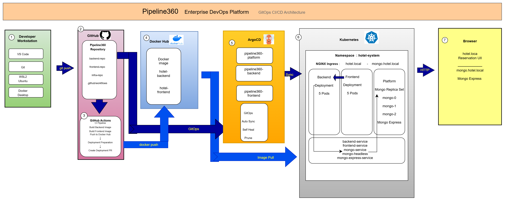

# Pipeline360

## Cloud-Native Hotel Reservation System

Pipeline360 is a three-tier hotel reservation platform designed to demonstrate a complete DevOps and GitOps workflow.

The project combines a browser-based frontend, a Node.js backend API, a MongoDB replica set, Docker container images, Kubernetes orchestration, GitHub Actions, Docker Hub, NGINX Ingress, and Argo CD.

The system is deployed to a local Kind Kubernetes cluster and managed through Git-based automated delivery.

---

## Project Objectives

Pipeline360 demonstrates:

- Three-tier application architecture
- Docker image build and publishing
- Kubernetes deployments and services
- High availability through multiple replicas
- Persistent MongoDB storage
- MongoDB replica-set operation
- Health and readiness monitoring
- CI automation with GitHub Actions
- Pull-request-based deployment preparation
- GitOps delivery with Argo CD
- Automated synchronization, self-healing, and pruning

---

## Application Features

The application allows users to:

- View hotels stored in MongoDB
- Create a new hotel reservation
- Receive a unique reservation ID
- Search by reservation ID, full name, or email address
- Display reservation details
- Cancel an existing reservation
- Prevent overlapping reservations for the same hotel
- Access MongoDB data through Mongo Express

The backend validates:

- Required reservation fields
- Email format
- Valid check-in and check-out dates
- Check-out date occurring after check-in
- Hotel existence
- Hotel availability for the requested date range

---

## Technology Stack

| Area | Technology |
|---|---|
| Frontend | HTML, CSS, JavaScript, NGINX |
| Backend | Node.js, Express, Mongoose |
| Database | MongoDB 7 Replica Set |
| Database UI | Mongo Express |
| Containerization | Docker |
| Container Registry | Docker Hub |
| Orchestration | Kubernetes |
| Local Cluster | Kind |
| Ingress | NGINX Ingress Controller |
| CI/CD | GitHub Actions |
| GitOps | Argo CD |
| Development Environment | Windows, WSL2 Ubuntu, Docker Desktop, VS Code |

---

## Repository Structure

```text
Pipeline360/
├── .github/
│   └── workflows/
│       ├── ci.yaml
│       └── deploy-prep.yaml
│
├── backend-repo/
│   ├── src/
│   │   ├── config/
│   │   ├── controllers/
│   │   ├── models/
│   │   ├── routes/
│   │   └── server.js
│   ├── Dockerfile
│   ├── package.json
│   └── README.md
│
├── frontend-repo/
│   ├── src/
│   │   ├── index.html
│   │   ├── lookup.html
│   │   ├── script.js
│   │   ├── lookup-script.js
│   │   └── style.css
│   ├── Dockerfile
│   ├── nginx.conf
│   ├── package.json
│   └── README.md
│
├── infra-repo/
│   ├── argocd/
│   │   ├── backend-app.yaml
│   │   ├── frontend-app.yaml
│   │   └── platform-app.yaml
│   │
│   └── kubernetes/
│       ├── backend/
│       │   ├── deployment.yaml
│       │   └── service.yaml
│       ├── frontend/
│       │   ├── deployment.yaml
│       │   └── service.yaml
│       ├── platform/
│       │   ├── app-config.yaml
│       │   ├── hotel-ingress.yaml
│       │   ├── mongo-express.yaml
│       │   ├── mongo-headless-service.yaml
│       │   ├── mongo-service.yaml
│       │   ├── mongo-statefulset.yaml
│       │   └── namespace.yaml
│       └── secrets/
│           └── db-secrets.yaml.template
│
├── PIPELINE360_STARTUP_GUIDE.md
├── start-pipeline360.sh
├── git-update.sh
├── docker-compose.yml
└── README.md
```

---

## System Architecture

Pipeline360 contains three application layers.

### Frontend Layer

The frontend is a static browser application served by NGINX.

It provides:

- New reservation screen
- Hotel selection
- Reservation lookup screen
- Reservation cancellation
- Communication with the backend through `/api`

Kubernetes runs:

```text
frontend-deployment
Replicas: 5
Service: frontend-service
Container port: 80
```

### Backend Layer

The backend is a Node.js and Express REST API connected to MongoDB using Mongoose.

It provides:

```text
GET    /health
GET    /ready
GET    /api/reservations/hotels
GET    /api/reservations/lookup/:query
POST   /api/reservations
DELETE /api/reservations/:id
```

Kubernetes runs:

```text
backend-deployment
Replicas: 5
Service: backend-service
Service port: 3000
```

### Database and Platform Layer

MongoDB runs as a three-member replica set:

```text
mongo-0
mongo-1
mongo-2
```

The platform layer also includes:

- `mongo-headless` for StatefulSet network identity
- `mongo` for backend database access
- Mongo Express
- Persistent Volume Claims
- ConfigMap
- NGINX Ingress
- Dedicated `hotel-system` namespace

---

## Kubernetes Architecture

| Resource | Name | Desired State |
|---|---|---:|
| Namespace | `hotel-system` | 1 |
| Backend Deployment | `backend-deployment` | 5 replicas |
| Frontend Deployment | `frontend-deployment` | 5 replicas |
| MongoDB StatefulSet | `mongo` | 3 replicas |
| Mongo Express Deployment | `mongo-express` | 1 replica |
| Backend Service | `backend-service` | Port 3000 |
| Frontend Service | `frontend-service` | Port 80 |
| MongoDB Service | `mongo` | Port 27017 |
| MongoDB Headless Service | `mongo-headless` | Port 27017 |
| Mongo Express Service | `mongo-express-service` | Port 8081 |
| Ingress | `hotel-ingress` | HTTP routing |

MongoDB creates one Persistent Volume Claim per replica:

```text
mongo-storage-mongo-0
mongo-storage-mongo-1
mongo-storage-mongo-2
```

---

## Ingress Routing

The NGINX Ingress exposes two local hosts:

| Host | Destination |
|---|---|
| `hotel.local` | Frontend and Backend API |
| `mongo.hotel.local` | Mongo Express |

Application routes:

```text
hotel.local/       → frontend-service:80
hotel.local/api    → backend-service:3000
mongo.hotel.local/ → mongo-express-service:8081
```

In the current Kind configuration, HTTP is available through host port `3000`:

```text
http://hotel.local:3000
http://mongo.hotel.local:3000
```

The Windows hosts file must contain:

```text
127.0.0.1 hotel.local
127.0.0.1 mongo.hotel.local
```

Windows hosts-file location:

```text
C:\Windows\System32\drivers\etc\hosts
```

---

## Argo CD GitOps

The project uses three separate Argo CD Applications.

| Application | Managed Path | Responsibility |
|---|---|---|
| `pipeline360-backend` | `infra-repo/kubernetes/backend` | Backend Deployment and Service |
| `pipeline360-frontend` | `infra-repo/kubernetes/frontend` | Frontend Deployment and Service |
| `pipeline360-platform` | `infra-repo/kubernetes/platform` | Namespace, MongoDB, Mongo Express, ConfigMap, and Ingress |

Each Application is configured with:

```yaml
automated:
  prune: true
  selfHeal: true
```

This enables:

- Automatic synchronization from `main`
- Recovery from manual cluster drift
- Removal of resources deleted from Git
- Independent health and synchronization status per component

Check all Applications:

```bash
kubectl get applications -n argocd \
  -o custom-columns='NAME:.metadata.name,SYNC:.status.sync.status,HEALTH:.status.health.status'
```

Expected state:

```text
NAME                   SYNC     HEALTH
pipeline360-backend    Synced   Healthy
pipeline360-frontend   Synced   Healthy
pipeline360-platform   Synced   Healthy
```

---

## CI/CD Workflow

### CI Pipeline

Workflow file:

```text
.github/workflows/ci.yaml
```

Trigger:

```text
Push to dev
```

Responsibilities:

1. Check out the source code
2. Configure Docker Buildx
3. Authenticate to Docker Hub
4. Build the frontend image
5. Push the versioned frontend image
6. Push the `latest` frontend image
7. Build the backend image
8. Push the versioned backend image
9. Push the `latest` backend image

Docker Hub repositories:

```text
eli0504167101/hotel-frontend
eli0504167101/hotel-backend
```

### Deployment Preparation

Workflow file:

```text
.github/workflows/deploy-prep.yaml
```

The workflow runs after a successful CI Pipeline execution from `dev`.

Responsibilities:

1. Check out `main`
2. Read the CI run number
3. Update backend and frontend image tags
4. Create a temporary deployment branch
5. Commit the manifest changes
6. Push the deployment branch
7. Open a Pull Request to `main`

The workflow does not push deployment changes directly to `main`.

Deployment changes require review and merge through a Pull Request.

### GitOps Deployment Flow

```text
Developer
   ↓
Push to dev
   ↓
GitHub Actions CI Pipeline
   ↓
Build and push Docker images
   ↓
Deployment Preparation
   ↓
Create deployment image-tag branch
   ↓
Open Pull Request to main
   ↓
Review and merge
   ↓
Argo CD detects the main-branch change
   ↓
Kubernetes rolling update
   ↓
Synced and Healthy applications
```

---

## Git Workflow

Development work is performed on the `dev` branch.

Recommended workflow:

```bash
git switch dev
git pull --ff-only origin dev

git status
git add <specific-files>
git commit -m "Describe the change"
git push origin dev
```

Then create a Pull Request:

```text
base: main
compare: dev
```

After the Pull Request is merged, synchronize the local branches:

```bash
git fetch origin --prune

git switch main
git pull --ff-only origin main

git switch dev
git merge --ff-only origin/main
git push origin dev
```

Verify synchronization:

```bash
git rev-list --left-right --count origin/main...origin/dev
```

Expected output:

```text
0    0
```

Avoid destructive Git operations such as:

```text
git reset --hard
git push --force
```

unless a reviewed recovery procedure explicitly requires them.

---

## Health and Readiness

Backend health endpoint:

```text
GET /health
```

Expected response:

```json
{
  "status": "healthy"
}
```

Backend readiness endpoint:

```text
GET /ready
```

Expected response:

```json
{
  "status": "ready",
  "database": "connected"
}
```

The Kubernetes Backend Deployment uses both endpoints for liveness and readiness probes.

The Frontend Deployment checks:

```text
/index.html
```

---

## Verification Commands

Check the active Kubernetes context:

```bash
kubectl config current-context
```

Expected context:

```text
kind-pipeline360-cluster
```

Check the node:

```bash
kubectl get nodes
```

Check workloads:

```bash
kubectl get deployments,statefulsets -n hotel-system
```

Check Pods:

```bash
kubectl get pods -n hotel-system
```

Check storage:

```bash
kubectl get pvc -n hotel-system
```

Check Ingress:

```bash
kubectl get ingress -n hotel-system
```

Check deployed images:

```bash
kubectl get deployment backend-deployment frontend-deployment \
  -n hotel-system \
  -o custom-columns='NAME:.metadata.name,IMAGE:.spec.template.spec.containers[0].image,READY:.status.readyReplicas,DESIRED:.spec.replicas'
```

Check application access:

```bash
curl -I \
  -H "Host: hotel.local" \
  http://127.0.0.1:3000/
```

Check the hotel API:

```bash
curl -I \
  -H "Host: hotel.local" \
  http://127.0.0.1:3000/api/reservations/hotels
```

---

## Starting the Project After a Computer Restart

Use the detailed startup guide:

```text
PIPELINE360_STARTUP_GUIDE.md
```

The guide covers:

- Starting Docker Desktop
- Opening WSL
- Checking the Kind cluster
- Verifying Kubernetes resources
- Starting local access commands
- Opening the frontend
- Opening Mongo Express
- Opening Argo CD
- Diagnosing common startup problems

A helper script is also available:

```bash
./start-pipeline360.sh
```

Review the script before running it and confirm that its ports match the current environment.

---

## Manual Deployment

The normal deployment method is GitOps through Argo CD.

For initial installation or controlled recovery, manifests can be validated with:

```bash
kubectl apply --dry-run=client \
  --recursive \
  -f infra-repo/kubernetes/
```

A manual apply can be performed with:

```bash
kubectl apply \
  --recursive \
  -f infra-repo/kubernetes/
```

Do not use manual `kubectl apply`, `kubectl set image`, or direct cluster edits for routine deployments because Argo CD self-healing may revert changes that are not committed to Git.

---

## Secret Management

The repository contains a Secret template:

```text
infra-repo/kubernetes/secrets/db-secrets.yaml.template
```

The live Kubernetes Secret is:

```text
mongo-express-auth
```

It contains:

```text
username
password
```

These credentials protect the Mongo Express web interface using Basic
Authentication.

MongoDB internal authentication is not enabled in the current local Kind
environment. The Backend connects to MongoDB using `MONGO_URL` from the
`app-config` ConfigMap.

Real credentials must not be committed to Git.

Verify the Secret without displaying its values:

```bash
kubectl get secret mongo-express-auth -n hotel-system
```

## Architecture Diagram

The following diagram illustrates the complete GitOps workflow and deployment architecture of the Pipeline360 platform.

<p align="center">
  
</p>

<!--
After exporting the final diagram, add:

docs/architecture.png
docs/architecture.drawio

Then replace this comment with:


-->

The architecture diagram presents:

- Developer workstation
- GitHub repository
- GitHub Actions
- Docker Hub
- Argo CD
- Kubernetes workloads and services
- MongoDB replica set
- NGINX Ingress
- Browser access

---

## Project Documentation

| Document | Purpose |
|---|---|
| `README.md` | Main project overview |
| `PIPELINE360_STARTUP_GUIDE.md` | Startup and recovery instructions |
| `backend-repo/README.md` | Backend API documentation |
| `frontend-repo/README.md` | Frontend documentation |
| `infra-repo/README.md` | Kubernetes, Argo CD, and CI/CD documentation |

---

## Future Improvements

Potential future enhancements:

- Automated tests in GitHub Actions
- Helm Charts
- Horizontal Pod Autoscaling
- Resource requests and limits
- Prometheus and Grafana monitoring
- TLS certificates
- External Secrets or Sealed Secrets
- MongoDB authentication hardening
- Mongo Express authentication
- Container vulnerability scanning
- Automated backup and restore validation

---

## Author

Developed by **Eliychu Hildesheim**

DevOps Final Project — Pipeline360
